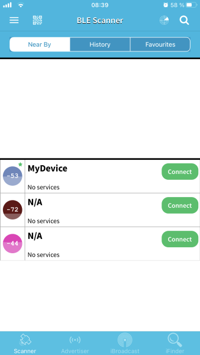
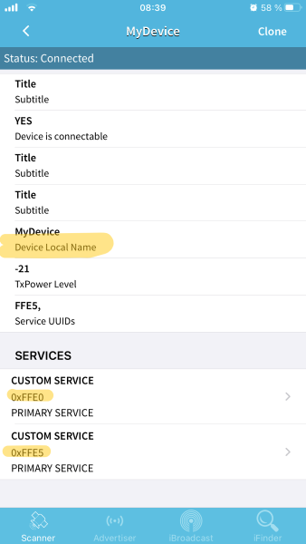
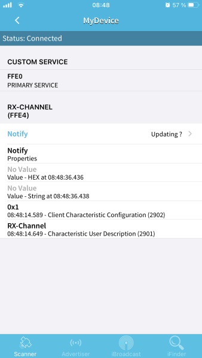
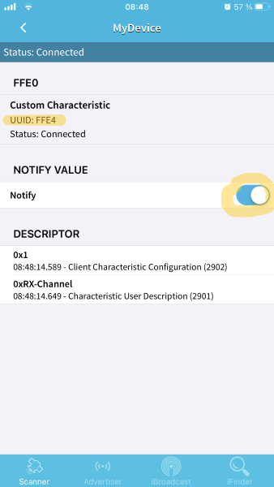
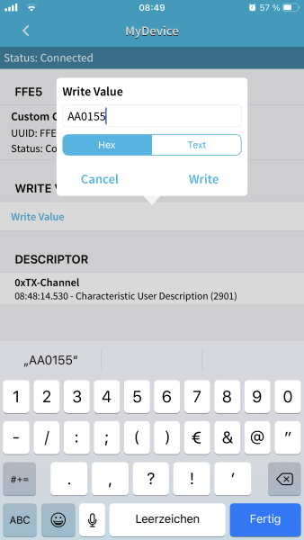
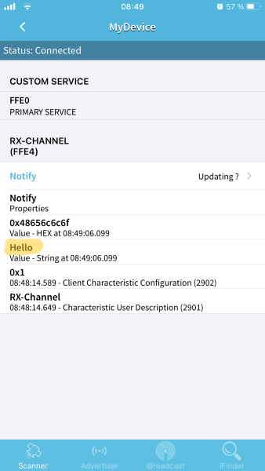

# Simple and lightweight C++ ESP32 BLE wrapper

For reverse engineering my CBT-Power LiFePo Battery BLE enabled BMS (selled as Creabest in Europe) I used the raw GATT-Server example provided by Espressif inside the ESP-IDF for Visual Studio Code.

They have a tutorial (which is quite ok but doesn't describe how to use if for multiple services) and an API documentation, but at least for the BLE component the documentation is nearly useless (December 2020) - it looks like a repeatition of the function and structure names as sentences. I guess the developers were short of time or it was written by someone else who didn't really know much about it.

However, not the best for starting completely new with BLE (like I did at this time). Fortunately I'm used to develop in C/C++ over two decades now, so the provided example code itself wasn't that hard to understand.

The BLE service idea is made for OOP and the raw C interface provided by espressif is a lot of writing the same stuff over and over again, so I decided to write a partially object oriented interface with low memory usage (not really more than the C example uses) and event handler support.

# Server

Here's an example creating two services with attributes and handling events on it. You can find the whole code inside the ``server_example.cpp`` file.

There will be two services, one for a read channel (RX, 0xffe0) and one for writing (TX, 0xffe5). Note that the UUIDs can be something else. Although it is called "read channel" in this example it is for nofication only.

The read channel has a single characteristic which allows a client to register for notifications (0xffe4) while the write channel is a single characteristic receiving the commands.

A client sends commands to the write channel and immediately gets a notification over the read channel containing the answer.

At first include all the framework stuff.

```C++
// main.cpp file
#include "freertos/FreeRTOS.h"
#include "freertos/task.h"
#include "freertos/event_groups.h"
#include "esp_system.h"
#include "esp_log.h"
#include "nvs_flash.h"
#include "esp_bt.h"

#include "esp_gap_ble_api.h"
#include "esp_gatts_api.h"
#include "esp_bt_main.h"
#include "esp_gatt_common_api.h"

#include "ble_server.h" // contains BLE the Server-Class.
```

Due to the name mangling differences between C and C++ the required ``app_main`` function has to be declared as C. This can be done either seperately in a ``main.h`` (or however the header should be named) or directly inside this file:

```C++
extern "C" void app_main(void);
```

The we define an app id like in the espressif example and a global pointer to the ``BLEServer`` instance:

```C++
#define APP_ID 0x55

BLEServer *pServer = nullptr;
```

This instance will be instantiated inside the ``app_main`` later. The next two functions are passed as the GAP and GATT event handler to the framework and do nothing but forwarding them to the ``BLEServer`` instance (if available):

```C++
static void OnGATTEvent(esp_gatts_cb_event_t event, esp_gatt_if_t gatts_if, esp_ble_gatts_cb_param_t *param)
{
    if (pServer)
        pServer->HandleGATTEvent(event, gatts_if, param);
}

static void OnGAPEvent(esp_gap_ble_cb_event_t event, esp_ble_gap_cb_param_t *param)
{
    if (pServer)
        pServer->HandleGAPEvent(event, param);
}
```

The first part of the ``app_main`` is the initialization like in the espressif BLE examples, the different part is creation and initialization of the ``BLEServer``-instance using ``"MyDevice"`` as device name, adding the services and attributes using the ``AddAttributes`` function and registration of the event handlers:

```C++
pServer = new BLEServer("MyDevice");
AddAttributes(pServer);

if (ret = esp_ble_gatts_register_callback(OnGATTEvent))
{
    ESP_LOGE("app", "Failed to register GATT event handler, error code = %x", ret);
    return;
}

if (ret = esp_ble_gap_register_callback(OnGAPEvent))
{
    ESP_LOGE("app", "Failed to register GAP event handler, error code = %x", ret);
    return;
}
```

## Adding services

As mentioned above in this example this is done in a function named ``AddAttributes`` (remind that this function has to be declared before the ``app_main``).

```C++
static void AddAttributes(BLEServer *pServ)
{
    pServ->AddService(0xffe5);
```

In the first line a service with 16bit UUID 0xffe5 is added. This is our write channel, declared in the next lines:

```C++
pServ->AddCharacteristic(
    &uuid_0xffe9,            // (1) UUID of the characteristic
    &char_prop_write_norsp,  // (2) property definition (write without response)
    ESP_GATT_PERM_WRITE,     // (3) permission flag (write)
    sizeof(v_tx),            // (4) maximum data size
    sizeof(v_tx),            // (5) current data size
    v_tx,                    // (6) the data block itself
    "TX-Channel",            // (7) name of the characteristic (user description 0x2901)
    OnChannelWrite           // (8) event handler for the characteristics
);
```

The yet not known variables and function will be described later, don't care about them yet. 

``AddCharacteristic`` requires a few parameters. The first one is a reference to the 16bit UUID ``(1)`` of the new characteristic followed by a the flags ``(2)`` to be used for it (see ``ble_server.h`` for more) and its permissions ``(3)``.

The next three fields are the maximum field size in bytes ``(4)``, number of bytes currently stored there ``(5)``and a pointer to the field data itself ``(6)``.

``"TX-Channel"`` is the user description ``(7)`` of the characteristic (the name of the field) and can be omitted (then the characteristic simply wouldn't have one).

The last parameter here is the event handler ``(8)`` which has to be called for any event on this characteristic, here it is ``OnChannelWrite``. Can be omitted or passed as ``NULL``.

You could add more characteristics to this service if you want, but for our example its enough.

At next we add the receive channel (0xffe4) as another service (0xffe0):

```C++
rx_svc_idx = pServ->AddService(0xffe0);

rx_char_idx = pServ->AddCharacteristic(
    &uuid_0xffe4,
    &char_prop_notify,
    ESP_GATT_PERM_READ,
    20, 20, v_rx,
    "RX-Channel",
    nullptr,            // here we don't use an event handler
    v_rx_config         // 2 byte configuration data for the user decription
                        // characteristic (0x2902)
);
```

Note the last argument ``v_rx_config`` which is required for characteristics notification or indication.
Here we store the indices of both the service (``rx_svc_idx``) and the characteristic 0xffe4 (``rx_char_idx``). We need them later for sending the notifications.

## Adding service data

The global variables used in the example so far are the following:

```C++
// 16bit UUIDs for the both characeristics
static const uint16_t
    uuid_0xffe4 = 0xffe4, // RX
    uuid_0xffe9 = 0xffe9; // TX

// 
static uint8_t
    v_rx[20] = {0},                    // readable value
    v_rx_config[2] = {0x00, 0x00},     // config for rx characteristic (required for notification)
    v_tx[20] = {0},                    // writeable value
    rx_svc_idx = 0,                    // index of service containing the rx characteristic
    rx_char_idx = 0;                   // index of rx characteristic
```

## Implementing the event handler

The only thing whats left now is the event handler which handles clients write operation on the 0xffe4 characteristic and sends the notification.
For simplicity we expect exactly three bytes for every write operation:

 * Header (0xAA)
 * Command (1 Byte)
 * Footer (0x55)

The handler has to have the following signature:

```C++
void OnChannelWrite(esp_gatts_cb_event_t event, esp_gatt_if_t gatts_if, esp_ble_gatts_cb_param_t *param)
```

``event`` is the event value itself, in this example it is always ``ESP_GATTS_WRITE_EVT``, because the characteristic 0xffe9 is write only.

``gatts_if`` is the interface number and needed for sending the notification.

``param`` is a union depending on the ``event`` value, in this example (where ``event = ESP_GATTS_WRITE_EVT``) it is always of type ``gatts_write_evt_param``.

The first thing we check in the handler is if the client has registered itself for receiving notifications on characteristic 0xffe4:

```C++
    if (0 != v_rx_config[0])
        return;
```

We don't have to do anything extra here, because the framework writes the value into ``v_rx_config`` which we have passed to the ``AddCharacteristics`` above.

After that we shorten the access to the event data, check its size (header + command + footer = 3 Byte) and the frame:

```C++
    esp_ble_gatts_cb_param_t::gatts_write_evt_param &data = param->write;

    // we expect a command as header (0xAA), command id (1 Byte), footer (0x55)
    if (data.len != 3)
        return;

    // check header and footer
    if (data.value[0] != 0xAA || data.value[2] != 0x55)
        return;
```

Now we know the received packet is valid and we look at the command id.

```C++
    uint8_t command = data.value[1]; // id of the command
    uint8_t response_length = 0;

    switch(command)
    {
        case 0x01:
            response_length = 5;
            memcpy(v_tx, "Hello", response_length);
            break;
        case 0x02:
            response_length = 3;
            memcpy(v_tx, "Bye", response_length);
            break;
        default:
            response_length = 4;
            memcpy(v_tx, "WTF?", response_length);
            break;
    }
```

Because the write value ``v_tx`` is not really used, we put the notification data we want to send into it.

For sending this notification we need the handle of the characteristic 0xffe4 (see ``AddCharacteristic`` above). Here we use the service (``rx_svc_idx``) and characteristic (``rx_char_idx``) index we got while registering it:

```C++
    uint16_t hdl = pServer->GetHandle(rx_svc_idx, rx_char_idx);
```

The only thing to do is sending the notification now. Don't mind about the ``indicate`` in the function name, setting the last argument to ``false`` means not to expect any response and so the indication (which requires a response) becomes a notification (which doesn't):

```C++
   esp_ble_gatts_send_indicate(gatts_if, data.conn_id, hdl, response_length, v_tx, false);
```

## Testing

Now its time to test by simply compiling everything and flashing your ESP32.
As soon as the ESP is up, you can use any BLE software (like *BLE Scanner* or *nRF Connect*) to test the BLE server.

I used the app *BLE Scanner* and immediately *"MyDevice"* appeared.
After clicking connect the both services ``0xffe0`` and ``0xffe5`` are visible.

 

For testing the notification, first push the ``0xffe0`` service, choose *"Notify Updating?*" and enable the *"Notify"* switch.

 

Then go back and change into the ``0xffe5`` service. There press *"Write Value"* and enter *"AA0155"* (0xAA = header, 0x01 = command, 0x55 = footer).

 

After clicking *"write"* the value has been sent to the ESP32, will be handled in our ``OnChannelWrite`` and in case command 0x01 the notification *"Hello"* should have been sent.
This can be checked by going back to the ``0xffe4`` characteristic:



Try any another command value and change the code for seeing the effects. Have fun with it!